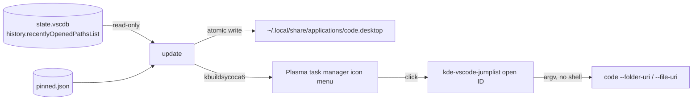

# kde-vscode-jumplist — details

Dynamic KDE Plasma task manager jump lists for VS Code — recent files, folders
and remote targets, with pinnable entries (like the VS Code dock/taskbar
menus on macOS and Windows).

A per-user systemd service watches VS Code's history, regenerates the VS Code
`.desktop` file with KDE jump-list `Actions`, and Plasma shows them in the task
manager icon menu. Clicking an entry opens it in VS Code via `--folder-uri` /
`--file-uri`; local **and** `vscode-remote://` URIs work.

The short version, with the screenshots, is in [README.md](README.md).

## Tested with

The screenshot above and the everyday development of this tool run on:

| Component | Version |
| --- | --- |
| KDE Plasma | 6.6.6 |
| KDE Frameworks (kservice, via `kbuildsycoca6`) | 6.24.0 |
| Qt (the `manage` dialog, via PyQt6) | 6.10.2 |
| VS Code | 1.137.0 |
| Python | 3.14.4 |
| Distribution | Ubuntu 26.04 LTS |

Python 3.11 or newer is required; the version above is simply what it was
developed against. KDE Frameworks 5 works too -- `kbuildsycoca5` is used as a
fallback when `kbuildsycoca6` is absent.

## How it works



- **Never modifies** VS Code's database (opened `mode=ro`).
- Every entry is a stable hashed ID; the URI is resolved from
  `entries.json` in the data directory (see [Layout](#layout)) at click time.
- Pinned entries live in `pinned.json` in the same directory and survive
  removal from VS Code's recent list.

## Install

```bash
make install    # builds the executable, then installs it and the service
```

`install` builds the CLI into a single self-contained executable and places it
together with a systemd user service:

| Path | What |
| --- | --- |
| `~/.local/bin/kde-vscode-jumplist` | the executable |
| `~/.config/systemd/user/kde-vscode-jumplist.service` | a long-running `update --watch` (every 5s) |
| `~/.config/kde-vscode-jumplist/` | `pinned.json`, `entries.json`, `sync.lock` |
| `~/.local/share/applications/code.desktop` | the generated menu file |

The service runs `update --watch` and does its own waiting, so there is no
scheduling unit to keep in step and no boot ordering to get wrong.
`make uninstall` removes the executable and the service; `make disable` stops it
without removing anything.

`install` **restarts** the service it just updated. The service owns the menu,
and a process keeps the code it started with — so replacing the executable
without restarting would leave the old code regenerating the menu every few
seconds, and an update would look like it had done nothing.

Check on it, or watch it work:

```bash
systemctl --user status kde-vscode-jumplist.service
journalctl --user -fu kde-vscode-jumplist.service
```

Prefer pipx? `pipx install . && kde-vscode-jumplist install` does the same,
using the console script instead of a built artifact.

Requirements: Python ≥ 3.11, KDE Plasma (kbuildsycoca6/5), systemd user units.
The `manage` dialog needs **Qt 6 through PyQt6**, which is a system package
(Debian/Ubuntu: `python3-pyqt6`; Fedora: `python3-pyqt6`; Arch: `python-pyqt6`).
Without it the CLI says so and every other command keeps working. Installing
from source with pip instead? `pip install -e '.[qt]'` pulls PyQt6 in.

Use the distribution package rather than `pip install PyQt6` where you can: it
shares Qt with the desktop, so it finds the KDE platform theme and draws the
dialog with Breeze and the theme's own icons. A wheel installed into a virtualenv
brings its own Qt, cannot load the system's KDE plugin, and falls back to Qt's
built-in style — the dialog still works, but it will not match the desktop.

## Usage

Right-click the VS Code icon in the task manager:

```
──────────────────
Recent Files:          ← click to pin, unpin and reorder
  <recent entries, newest first>
──────────────────
Pinned Files: ▹          ← click to pin, unpin and reorder
  ☆ <pinned entries>
──────────────────
```

A menu separator cannot carry text, so the two block headings are real actions,
and both of them are clickable: either one opens the dialog, so there is no
separate "Manage Pinned Files" entry to go looking for. The **Pinned Files:**
heading carries the manager's own icon — a bookmark with a plus — and ends with
the same chevron a submenu row carries; the **Recent Files:** heading keeps its
clock and has no chevron.

The chevron is part of the heading's text, pushed to the right edge by padding.
A Qt menu draws each item's text from a fixed left inset, so the only way for the
marker to reach the border is for the heading to be the widest item in the menu;
the padding is therefore sized off the longest label that gets listed. That puts
it 23px from the border, against 28px when the text ends at the shortcut column
instead.

Only the *overhang* is padded: the heading already carries `Pinned Files:`, so
that much width is free, and padding past the point where the heading is already
the widest item cannot move the marker any further right — it only widens the
menu. Charging for the base text again was worth about 82px of bare menu. The
arithmetic cannot be exact without font metrics, which the module does not have
(Qt is optional), so a small margin is built into the free width; a character
count is only a rough proxy for width. Measured against realistic path-like
labels, the marker reaches the edge at every length up to about 50 characters.
Past that it falls a few pixels short, which is the safe direction to be wrong
in: the heading stops being the widest item, the marker drifts slightly in, and
the menu stays as narrow as the label requires.

The glyph is `U+25B9` WHITE RIGHT SMALL TRIANGLE — a hollow arrow head. Hollow
rather than solid because at this size a filled triangle reads as a bullet rather
than an arrow, and because the outline matches the outlined style of the
surrounding chrome. It is the small variant of `U+25B7`, so it carries the same
open shape and stroke weight one size down, which suits a menu row better than
the medium one. Measured in the menu font, the right-pointing candidates render:
`U+203A` 3×7, `U+232A` 3×11, `U+22B3` 7×6, `U+25B9` 7×8, `U+2BC7` 8×8, `U+300B`
7×11, `U+25B7` 10×12 and the solid `U+25B6` 11×12. It draws in the theme's text
colour rather than as a colour emoji.

It is a stand-in rather than the real thing, which cannot be had. The style draws
an arrow only for an action that actually has a submenu, and a desktop action
cannot have one: `KServiceAction` carries `Name`, `Icon`, `Exec` and `NoDisplay`
and nothing else, and `Backend::jumpListActions` in
`applets/taskmanager/backend.cpp` turns each one into a bare `QAction` —
`setMenu` is never called.

Plasma's own task-manager entries follow the closing line, so "Pin to Task
Manager" / "Unpin from Task Manager" sit under a separator rather than against
the last entry.

Pinned entries are marked by a **star icon** rather than a text marker, and the
label is left exactly as VS Code reports it. Recents use a per-kind icon (a
folder for a folder, a document for a file), so the star is the one thing that
reads as "pinned" — and no `[pinned]` suffix appears in the menu. Workspace
entries have no dedicated icon (Breeze has none) and use the generic fallback;
recents exclude that kind by default anyway.

The order above is the one it always uses: the recents first, the pinned entries
below them. The menu always ends with a separator, so the last entry does not sit
against the bottom edge.

`recent` is the command to start with: it refreshes from VS Code and lists
entries with the ID that `pin`/`unpin` expect.

`update --watch` keeps a foreground process running instead of relying on
anything scheduled: it syncs, waits (5s by default, or the number after
`--watch`), and repeats until Ctrl-C. Each pass takes the same lock as every
other sync, so a second watcher cannot interleave with it.

```bash
kde-vscode-jumplist recent           # refresh + list entries with IDs
kde-vscode-jumplist recent --uri     # ... also showing each URI
kde-vscode-jumplist recent --all     # ... including workspaces
kde-vscode-jumplist update           # regenerate the menu
kde-vscode-jumplist pin <entry-id>
kde-vscode-jumplist unpin <entry-id>
kde-vscode-jumplist pinned           # list pinned entries
kde-vscode-jumplist manage           # pin and reorder pinned entries in a dialog
kde-vscode-jumplist update --watch   # keep running, syncing every 5s
kde-vscode-jumplist update --watch 2 # ... or every 2s
kde-vscode-jumplist reset            # rebuild the generated code.desktop
```

```
$ kde-vscode-jumplist recent
Entry ID          Kind       Label                                 Pinned
----------------  ---------  ------------------------------------  --------
fcd9d58e2be2e993  folder     ~/Github/virteye-ui [SSH: clawz]      yes
e30f7c023d2e517b  folder     Downloads
15fbdf61bc4424dc  folder     kde-vscode-jumplist
684ac7dfde5f6b47  folder     myai

75 entries - pin one with: kde-vscode-jumplist pin <entry-id>
(1 hidden: workspace - pass --all to show them)
```

`open <entry-id>` also exists, but is internal: the generated menu actions call
it. Remote entries are recognisable by the `[SSH: host]` suffix VS Code puts in
their label; `--uri` adds a full URI column when you need the exact target.

Workspaces (`.code-workspace`) are left out of the recent list by default, since
one usually repeats a folder that is already listed. Pinning one still shows it,
and `recent --all` lists them so you can find an ID.

## Notes

- The **Pinned Files: ▹** heading, the menu's way into the dialog, opens a
two-pane dialog: **every** recent VS Code entry in the left pane, the pinned
entries the menu lists in the right, each with its own search box. The two panes
are independent lists rather than a transfer box, so an entry that is pinned
appears in **both**, and the recents pane never changes: `>` adds the selected
recents to the pinned entries and `<` removes the selected pinned entries, while
`^` and `v` move the selected pinned entries up and down within the pinned
list. Since the jump list lists the pinned entries in that stored order,
reordering here reorders the menu.

  **The recents are always on the left and the pinned entries on the right**, the
same order the menu lists its two blocks in. The two transfer arrows point at the
pane they send entries to — `>` to the pinned list, `<` back to the recents — and
each names that list in its tooltip.

  **Only one pane is selected at a time.** Clicking a row in the recents list
drops any selection in the pinned list, and the other way round, so it is
always unambiguous which list the four buttons will act on. Within a single
pane, selection is the usual one: a click selects a row, **Ctrl**-click adds or
removes one row, and **Shift**-click extends a range from the last row clicked
(**Ctrl+Shift** adds that range instead of replacing the selection with it).

  **Right-clicking a row** offers three things to do with that one entry:
**Open in Code** (the way a menu click opens it), **Open Folder** — the
directory holding it, which is the entry itself for a folder and its parent for
a file — and **Copy Path**, the decoded path ready to paste into a shell. The
same three rows in either pane: what can be done with an entry does not depend
on which of the two lists it is in. The two rows that need a path *on this
machine* are greyed out for a remote entry, which is not a rare case here — a
folder on another host is one of the things a jump list is most useful for, and
neither showing it nor copying ``/srv/app`` for it would mean anything locally.
The rows stay listed greyed rather than disappearing, so the menu keeps its
shape and the reason is visible. No row writes anything, so a right-click can
never change the pinned entries or dirty the dialog.

  The **icons are the menu's own**: the pane headings reuse the jump-list
  captions' icons (`clock` for recents, `bookmark-new` for pinned) and every row
  shows the icon behind it — a folder or a document by kind, a star for anything
  pinned. They are read from the same tables the menu is generated from, so the
  dialog and the right-click menu cannot drift apart.

  Only the pinned entries are ever written. No button modifies the recents list —
  not the data, not the view, and never VS Code's own history — so this dialog
  cannot lose a recent entry. Edits are written as they are made and the menu is
  regenerated when the window closes, so there is no Cancel button: closing
  never discards anything.

  

  The footer row has **About** at the left edge and **Close** at the right. About
opens a single page listing the project name, version, commit, author
and the GitHub URL (which is clickable), each read from the package or
`pyproject.toml` rather than written out, with a test keeping the two in
step. It is a plain dialog rather than a richer About box, which would add a
large logo and a separate credits page that this does not need.

  The commit is shown abbreviated (7 characters), and comes from
  `buildinfo.git_id()`: the checkout is asked directly when the program runs from
  source, while an installed copy is a zipapp that carries no `.git` of its own,
  so `make build` stamps the id into the copy it bundles. Where neither is
  available — a build outside a repository, or a machine with no git — the window
  says `unknown` rather than failing to open, and the id is read once and cached,
  since it cannot change under a running process.
- The dialog is drawn with **Qt 6** (PyQt6), in a two-pane shape. Qt is chosen
because it draws the desktop's *own* style: with the KDE platform theme loaded it
uses Breeze and resolves the same icon names the jump list uses, so the dialog and
the menu cannot drift apart. Its `ExtendedSelection` **is** the usual click
behaviour — plain click replaces, Ctrl toggles, Shift selects a range, Ctrl+Shift
extends it, a click past the last row clears — so almost none of it is written
out by hand. Qt 6 also has a real Wayland backend, so the window is native rather
than going through XWayland. Without PyQt6, `manage` reports what is missing and
every other command is unaffected.
- The dialog sets `QT_QPA_PLATFORMTHEME=kde` itself, unless the session already
chose one. Qt reads the platform theme once, when the application is created, and
without one it resolves *no* theme icons at all — silently. Setting it is what
keeps the dialog looking like the desktop rather than like Qt.
- The row a **Shift** range is measured from is kept by the dialog rather than by
Qt. Qt remembers it privately and does not forget it when the selection is
cleared, and the two panes clear each other on every click — so a Shift click
after a click in the other pane would have extended from a row that was no longer
selected, a range appearing out of nowhere.
- KDE's desktop-action API has no inline pin buttons, which is why the pinning
happens in that dialog rather than in the menu itself.
- The dialog's two panes are fixed: recents on the left, pinned entries on the
  right, the order the menu lists its blocks in. The transfer arrows follow —
  `<` sends entries to the recents on the left (unpin), `>` to the pinned list
  on the right (pin), each named in its tooltip — so an arrow never moves
  entries away from where it points, and nothing about the layout depends on a
  setting.
- The context-menu policy is set on the **entry list**, not on its viewport.
  The platform delivers the context-menu event to the viewport, which ignores it
  under its default policy, and Qt then hands it to the scroll area — so a policy
  set on the viewport is never consulted and the menu simply never opens. The
  position that arrives is in the viewport's coordinates, which is what
  `itemAt()` and the popup both take. (Measured against Qt 6.10.2, not assumed.)
- "Open Folder" goes through `xdg-open` rather than naming a file manager, the
  way every other action goes through the CLI rather than naming an editor: on
  this desktop it resolves to `org.kde.dolphin.desktop`, and on a session that
  picked something else it resolves to that. The directory is not checked for
  existence first — the desktop reports a path that is gone — and the path is
  the decoded one, so a project named `My Projects` opens and copies as itself.
- Every context-menu row is read-only, and "Copy Path" is the only one that is
  not a subprocess: the clipboard belongs to the running `QApplication`, which is
  another reason the application is kept alive at module scope in `qtview.py`.
  A Wayland or X11 clipboard is served by the process that filled it.
- The `Pinned Files:` / `Recent Files:` headings are real actions, because a
  menu separator cannot carry text, and both open the dialog. The pinned one is
  the one the menu can never do without — it is always present, even with
  nothing pinned, so there is always something to click — and it carries the
  manager's `bookmark-new` icon. The recents one appears only when there are
  recents to head, and carries `clock`. Pinned entries in the **menu** use
  Breeze's filled star (`starred`), so a heading is never mistaken for an entry
  or for the other heading; the **dialog** draws the outline star
  (`manage.PINNED_ROW_ICON`, `non-starred`) on its own pinned rows. That is the
  one icon the two surfaces deliberately disagree on, and they are separate
  constants so either can be changed without dragging the other along.
- The launcher written into each action's `Exec=` is verified before use, so a
  menu entry cannot silently do nothing. `make install` resolves it to the one
  self-contained file: `Exec=/home/you/.local/bin/kde-vscode-jumplist open <id>`.
- The built executable is a snapshot: re-run `make build` (or `make install`)
  after changing the code. `bin/` is gitignored.

## Layout

Where everything lives is fixed, so there is nothing to configure and no file to
keep in step with:

| Path | What |
| --- | --- |
| `~/.config/kde-vscode-jumplist/` | the tool's own files: `pinned.json`, `entries.json`, `sync.lock` |
| `~/.local/share/applications/` | where the generated `.desktop` file is written |
| `~/.local/bin/` | the installed executable |

The two directories come from the XDG base directories (`$XDG_CONFIG_HOME` and
`$XDG_DATA_HOME`), read at call time, and fall back to `~/.config` and
`~/.local/share` as the specification says. Nothing else is settable — and in
particular nothing depends on the working directory: the same paths are used
whether a command is run from a checkout, from a shell in `$HOME`, or by the
service. A relative `$XDG_CONFIG_HOME`/`$XDG_DATA_HOME` is ignored rather than
resolved, since XDG requires an absolute path and resolving one is what would
put a data directory inside whatever directory the command ran from.

Both are created as needed: the CLI makes the data directory as it starts, and
the writers create their own parents, so a first run needs no preparation.

VS Code itself is found rather than configured: every installation with an
executable, a desktop file and a state database is used, and each one's history
feeds its own generated menu file. The shared database
(`~/.vscode-shared/sharedStorage/state.vscdb`) is read as well as the profile
one, because on most installs -- this one included -- that is where the recently
opened list actually lives.

Which *family* of editors is aimed at is the one choice: the `FORK`
environment variable, `VSCODE` by default and `BUDDY` for Tencent CodeBuddy CN
(`buddycn`, `~/.config/CodeBuddy CN`, no shared database). It is read at call
time, and an unknown or empty value falls back to the default. The service is
where a shell's exports do not reach, so `install` resolves the fork and writes
it into the unit as `Environment=FORK=...`; `FORK=BUDDY make install` is the
way to switch the watcher over. Clicks need no fork at all: a menu action
resolves the entry's own editor across every fork, since Plasma launches it
with no FORK of its own.

### How the menu is built

Two things about the menu are fixed in the code as well:

- **At most 12 entries, pinned entries first.** The pinned block is listed in
  full (up to the whole budget) and the recents fill whatever is left, in MRU
  order. So a long pinned list shortens the recents rather than growing the
  menu, and a menu with nothing pinned lists up to 12 recents.
- **Workspaces are left out of the recents**, since a `.code-workspace` usually
  repeats a folder that is already listed and opening one is a different action
  from opening the folder. Pinned entries are never filtered, so a pinned
  workspace still appears, and `recent --all` lists them so an ID can be found.
  The exclusion is applied before the limit, so the 12 counts entries that are
  actually listed.

## Makefile

```bash
make build               # build the single-file executable
make recent              # refresh + list recent entries (make recent ARGS=--uri)
make update              # regenerate the context menu
make watch               # keep running, syncing every 5s (WATCH=2 to change)
make pin ID=<id>         # pin an entry (ids come from `make recent`)
make unpin ID=<id>       # unpin an entry
make pinned              # list pinned entries
make manage              # pin and reorder pinned entries in a dialog
make test                # run pytest
make install             # build, then install the executable + systemd service
make enable              # enable --now the service (start watching)
make disable             # disable --now the service (stop watching)
make uninstall           # remove them
make reset               # rebuild the generated code.desktop
```

`make reset` repairs the **menu file** and nothing else. A generated
`~/.local/share/applications/code.desktop` is the vendor entry with this tool's
`Actions=` groups appended, and `reset` deletes it and writes it again from the
vendor text — which is what fixes a file that was hand-edited or truncated.

It deliberately does **not** run a sync: your saved pinned entries, the entry
cache (`entries.json`) and the systemd service are all left exactly as they are,
and the menu is rebuilt from the entries already stored, so it keeps listing the
same things. Only files this tool generated are removed — another application's
desktop entry, and any VS Code entry that is not ours, are left alone. Use
`make uninstall` to remove the program itself.

`enable`/`disable` act on the service itself, which can be enabled because it
is long-running and has an `[Install]` section. `disable` stops it and leaves
the menu as it is: it simply stops being refreshed automatically.

## Tests

```bash
make test        # or: pytest
```

Nearly all of it runs headlessly, with no display and no Qt: everything that
decides *what* the manage dialog shows and writes lives in a model that imports
no toolkit, so the search, the pinning and the reordering are covered directly.

The window itself is built and inspected by a smaller set of tests, which need
PyQt6. They run under Qt's own `offscreen` platform, so they work in a headless
checkout too. The assertions about the desktop's icon theme skip where it cannot
be reached — notably a PyPI PyQt6 in a virtualenv, which brings its own Qt and
cannot load the system's KDE plugin — while everything structural still runs.

Each user runs their own service and reads their own VS Code history; no root
involvement.
