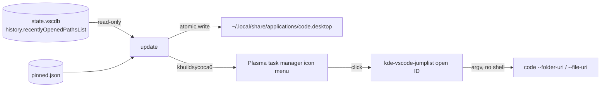

# kde-vscode-jumplist — details

Dynamic KDE Plasma task manager jump lists for VS Code — recent files, folders
and remote targets, with pinnable entries (like the VS Code dock/taskbar
menus on macOS and Windows).

A per-user systemd service watches VS Code's history, regenerates the VS Code
`.desktop` file with KDE jump-list `Actions`, and Plasma shows them in the task
manager icon menu. Clicking an entry opens it in VS Code via `--folder-uri` /
`--file-uri`; local **and** `vscode-remote://` URIs work.

The short version, with the screenshots, is in [README.md](README.md).

## Tested with

The screenshot above and the everyday development of this tool run on:

| Component | Version |
| --- | --- |
| KDE Plasma | 6.6.6 |
| KDE Frameworks (kservice, via `kbuildsycoca6`) | 6.24.0 |
| Qt (the `manage` dialog, via PyQt6) | 6.10.2 |
| VS Code | 1.137.0 |
| Python | 3.14.4 |
| Distribution | Ubuntu 26.04 LTS |

Python 3.11 or newer is required; the version above is simply what it was
developed against. (`config.toml` is read with the standard library's
`tomllib`, which is where it entered the standard library.) KDE Frameworks 5
works too -- `kbuildsycoca5` is used as a fallback when `kbuildsycoca6` is
absent.

## How it works



- **Never modifies** VS Code's database (opened `mode=ro`).
- Every entry is a stable hashed ID; the URI is resolved from
  `entries.json` in the data directory (see
  [Configuration](#configuration)) at click time.
- Pinned entries live in `pinned.json` in the same directory and survive
  removal from VS Code's recent list.

## Install

```bash
make install    # builds the executable, then installs it and the service
```

`install` builds the CLI into a single self-contained executable and places it
together with a systemd user service:

| Path | What |
| --- | --- |
| `~/.local/bin/kde-vscode-jumplist` | the executable |
| `~/.config/systemd/user/kde-vscode-jumplist.service` | a long-running `update --watch` (every 5s), reading the configuration file named in its `ExecStart=` |
| `~/.config/kde-vscode-jumplist/config.toml` | the settings the service reads; copied from the checkout's `config.toml` the first time |
| `~/.config/kde-vscode-jumplist/` | `pinned.json`, `entries.json`, `sync.lock` |

There is no timer: the service runs `update --watch` and does its own waiting,
which means no boot ordering to get wrong and no scheduling units to keep in
step. `make uninstall` removes the executable and the service; `make disable`
stops it without removing anything.

`install` **restarts** the service it just updated. The service owns the menu,
and a process keeps the code it started with — so replacing the executable
without restarting would leave the old code regenerating the menu every few
seconds, and an update would look like it had done nothing.

Check on it, or watch it work:

```bash
systemctl --user status kde-vscode-jumplist.service
journalctl --user -fu kde-vscode-jumplist.service
```

Prefer pipx? `pipx install . && kde-vscode-jumplist install` does the same,
using the console script instead of a built artifact.

Requirements: Python ≥ 3.11, KDE Plasma (kbuildsycoca6/5), systemd user units.
The `manage` dialog needs **Qt 6 through PyQt6**, which is a system package
(Debian/Ubuntu: `python3-pyqt6`; Fedora: `python3-pyqt6`; Arch: `python-pyqt6`).
Without it the CLI says so and every other command keeps working. Installing
from source with pip instead? `pip install -e '.[qt]'` pulls PyQt6 in.

Use the distribution package rather than `pip install PyQt6` where you can: it
shares Qt with the desktop, so it finds the KDE platform theme and draws the
dialog with Breeze and the theme's own icons. A wheel installed into a virtualenv
brings its own Qt, cannot load the system's KDE plugin, and falls back to Qt's
built-in style — the dialog still works, but it will not match the desktop.

## Usage

Right-click the VS Code icon in the task manager:

```
──────────────────
Recent Files:
  <recent entries, newest first>
──────────────────
Pinned Files:
  ★ <pinned entries>
──────────────────
Manage Pinned Files…
```

Plasma's own task-manager entries follow the last line, so the dialog sits
directly above "Pin to Task Manager" / "Unpin from Task Manager".

Pinned entries are marked by a **star icon** rather than a text marker, and the
label is left exactly as VS Code reports it. Recents use a per-kind icon (a
folder for a folder, a document for a file), so the star is the one thing that
reads as "pinned" — and no `[pinned]` suffix appears in the menu. Workspace
entries have no dedicated icon (Breeze has none) and use the generic fallback;
recents exclude that kind by default anyway.

The order above is `pinned_position = "below"`, which lists the recents first;
`"above"` puts the pinned entries first. The menu always ends with a separator,
so the last entry does not sit against the bottom edge.

`recent` is the command to start with: it refreshes from VS Code and lists
entries with the ID that `pin`/`unpin` expect.

`update --watch` keeps a foreground process running instead of relying on
anything scheduled: it syncs, waits (5s by default, or the number after
`--watch`), and repeats until Ctrl-C. Each pass takes the same lock as every
other sync, so a second watcher cannot interleave with it.

```bash
kde-vscode-jumplist recent           # refresh + list entries with IDs
kde-vscode-jumplist recent --uri     # ... also showing each URI
kde-vscode-jumplist recent --all     # ... including workspaces
kde-vscode-jumplist update           # regenerate the menu
kde-vscode-jumplist pin <entry-id>
kde-vscode-jumplist unpin <entry-id>
kde-vscode-jumplist pinned           # list pinned entries
kde-vscode-jumplist manage           # pin and reorder pinned entries in a dialog
kde-vscode-jumplist update --watch   # keep running, syncing every 5s
kde-vscode-jumplist update --watch 2 # ... or every 2s
kde-vscode-jumplist --config /tmp/other.toml recent  # read another config.toml
kde-vscode-jumplist install-config   # apply this config.toml to the service's copy
kde-vscode-jumplist reset            # rebuild the generated code.desktop
```

```
$ kde-vscode-jumplist recent
Entry ID          Kind       Label                                 Pinned
----------------  ---------  ------------------------------------  --------
fcd9d58e2be2e993  folder     ~/Github/virteye-ui [SSH: clawz]      yes
e30f7c023d2e517b  folder     Downloads
15fbdf61bc4424dc  folder     kde-vscode-jumplist
684ac7dfde5f6b47  folder     myai

75 entries - pin one with: kde-vscode-jumplist pin <entry-id>
(1 hidden: workspace - set exclude_kinds in ~/.config/kde-vscode-jumplist/config.toml to change, or pass --all)
```

`open <entry-id>` also exists, but is internal: the generated menu actions call
it. Remote entries are recognisable by the `[SSH: host]` suffix VS Code puts in
their label; `--uri` adds a full URI column when you need the exact target.

Workspaces (`.code-workspace`) are left out of the recent list by default, since
one usually repeats a folder that is already listed. Pinning one still shows it,
and `recent --all` lists them so you can find an ID.

## Notes

- **Manage Pinned Files…**, the last entry in the menu, opens a two-pane
dialog: the pinned entries the menu lists in one pane, **every** recent VS Code
entry in the other, each with its own search box. The two panes are independent
lists rather than a transfer box, so an entry that is pinned appears in **both**,
and the recents pane never changes: one arrow adds the selected recents to the
pinned entries and the other removes the selected pinned entries, while `^` and
`v` move the selected pinned entries up and down within the pinned list. Since
the jump list lists the pinned entries in that stored order, reordering here
reorders the menu.

  **Which pane is on the left follows `pinned_position`**, the setting that also
orders the menu — so the dialog reads the way the menu it was opened from does:
the menu lists its blocks top to bottom, the dialog lists them left to right.
With the default `"above"` the pinned pane is on the left; with `"below"` the
recents are. The two transfer arrows always point at the pane they send entries
to, and each names that list in its tooltip — so which arrow pins depends on the
order, but an arrow never moves entries away from where it points.

  **Only one pane is selected at a time.** Clicking a row in the recents list
drops any selection in the pinned list, and the other way round, so it is
always unambiguous which list the four buttons will act on. Within a single
pane, selection is the usual one: a click selects a row, **Ctrl**-click adds or
removes one row, and **Shift**-click extends a range from the last row clicked
(**Ctrl+Shift** adds that range instead of replacing the selection with it).

  The **icons are the menu's own**: the pane headings reuse the jump-list
  captions' icons (`clock` for recents, `bookmarks` for pinned) and every row
  shows the icon behind it — a folder or a document by kind, a star for anything
  pinned. They are read from the same tables the menu is generated from, so the
  dialog and the right-click menu cannot drift apart.

  Only the pinned entries are ever written. No button modifies the recents list —
  not the data, not the view, and never VS Code's own history — so this dialog
  cannot lose a recent entry. Edits are written as they are made and the menu is
  regenerated when the window closes, so there is no Cancel button: closing
  never discards anything.

  

  The footer row has **Settings** and **About** at the left edge and **Close** at
the right. About opens a single page listing the project name, version, author
and the GitHub URL (which is clickable), each read from the package or
`pyproject.toml` rather than written out, with a test keeping the two in
step. It is a plain dialog rather than a richer About box, which would add a
large logo and a separate credits page that this does not need.
- The dialog is drawn with **Qt 6** (PyQt6), in the same two-pane shape. Qt was
chosen over GTK 3, which drew it before, for two reasons. It draws the desktop's
*own* style: with the KDE platform theme loaded Qt uses Breeze and resolves the
same icon names the jump list uses, so the dialog and the menu cannot drift
apart — GTK needed a separate Breeze GTK theme to look like a KDE window at all.
And Qt's `ExtendedSelection` **is** the usual click behaviour — plain click
replaces, Ctrl toggles, Shift selects a range, Ctrl+Shift extends it, a click
past the last row clears — so almost none of it is written out by hand, where
GTK 3 has no such mode and its `MULTIPLE` mode *adds* to the selection on a
plain click. Qt 6 also has a real Wayland backend, so the window is native
rather than going through XWayland. Without PyQt6, `manage` reports what is
missing and every other command is unaffected.
- The dialog sets `QT_QPA_PLATFORMTHEME=kde` itself, unless the session already
chose one. Qt reads the platform theme once, when the application is created, and
without one it resolves *no* theme icons at all — silently. Setting it is what
keeps the dialog looking like the desktop rather than like Qt.
- The row a **Shift** range is measured from is kept by the dialog rather than by
Qt. Qt remembers it privately and does not forget it when the selection is
cleared, and the two panes clear each other on every click — so a Shift click
after a click in the other pane would have extended from a row that was no longer
selected, a range appearing out of nowhere.
- KDE's desktop-action API has no inline pin buttons, which is why the pinning
happens in that dialog rather than in the menu itself.
- The dialog's two panes are ordered by `pinned_position`, the same setting that
orders the menu, so the two read alike: the menu lists its blocks top to bottom
and the dialog lists them left to right. The transfer arrows are therefore named
for their *direction* rather than for pinning — the arrow is always the direction
the entries travel, and the tooltip names the list they arrive in — because which
arrow pins changes with the order. The alternative, arrows fixed to their
operation, would leave one of the two layouts with an arrow pointing away from
the list it moves entries into.
- The `Pinned Files:` / `Recent Files:` headings are inert actions, because a
  menu separator cannot carry text. Each appears only when its block has
  entries. Pinned items use the `starred` icon, the headings use `bookmarks`
  and `clock`, and the manager uses `bookmark-new`, so a heading is never
  mistaken for an entry, for the other heading, or for the manager.
- The launcher written into each action's `Exec=` is verified before use, so a
  menu entry cannot silently do nothing. `make install` resolves it to the one
  self-contained file: `Exec=/home/you/.local/bin/kde-vscode-jumplist --config /home/you/.config/kde-vscode-jumplist/config.toml open <id>`.
- Each action's `Exec=` names the **configuration file** it was generated with.
  A click is a bare process launch whose working directory and environment are
  its own, so a menu built from a checkout's `config.toml` would otherwise be
  read back through a different file -- or, if none were found, fail outright
  instead of opening anything.
- The built executable is a snapshot: re-run `make build` (or `make install`)
  after changing the code. `bin/` is gitignored.

## Configuration

Everything is configured in one TOML file. It is looked for in this order, and
the first one that exists wins:

1. `./config.toml` — a checkout, or an install that carries its own file
2. `~/.config/kde-vscode-jumplist/config.toml` — where `install` puts it

`--config PATH` names a file instead of searching, and it is what the generated
menu actions and the systemd unit carry: a click is a plain process launch in a
working directory of its own, so it has to be told which file to read.

**There are no built-in defaults.** The file is the only source of the settings,
so every key below is required and anything missing — file or key — is an error
naming what is absent. A default would have to mean somewhere in your home
directory, and a run that quietly used it would write where nobody chose. The
`install` command copies the file it was run against to
`~/.config/kde-vscode-jumplist/config.toml` the first time (never overwriting an
existing one), and the service reads that copy from then on — so editing it is
how what runs in the background is changed.

### Which file is actually in effect

Two files can be called `config.toml`, and only one of them is read at any given
moment. This is worth knowing before editing either, because a change that
appears to do nothing is almost always a change made to the other one:

| File | Read by |
| --- | --- |
| `./config.toml` | `make …` targets and any command run from the checkout |
| `~/.config/kde-vscode-jumplist/config.toml` | the installed service, and the menu actions |

A checkout's file is only consulted when the user's own does not exist — so once
the service is installed, the installed copy is the one that counts. That also
means a foreground `make update` is undone a few seconds later, when the watcher
next regenerates the menu from the file it reads.

To apply an edit made in a checkout, use `install-config`, which copies the file
in use over the installed one:

```bash
make install-config            # or: kde-vscode-jumplist install-config
```

No restart is needed: the watcher re-reads the file when it changes and picks the
new settings up on its next pass. `install` itself deliberately does *not* do
this — it never overwrites an installed configuration, so reinstalling cannot
discard settings a running service was started with. When the two have drifted
apart, `install` says so:

```
using the existing configuration at ~/.config/kde-vscode-jumplist/config.toml
note: ./config.toml differs from it, and the service reads ~/.config/kde-vscode-jumplist/config.toml
      run `kde-vscode-jumplist install-config` to apply the settings in ./config.toml
```

Every setting is named, so nothing is left implicit. These are the values the
project starts from:

```toml
data_dir = "~/.config/kde-vscode-jumplist"
apps_dir = "~/.local/share/applications"
vscode_dir = ""
state_db = ""
shared_db = ""
desktop = ""
exec = ""
max_recents = 10
exclude_kinds = ["workspace"]
pinned_position = "above"
```

| Setting | Meaning |
| --- | --- |
| `data_dir` | all of the tool's own files: `pinned.json`, `entries.json`, `sync.lock` |
| `apps_dir` | where the generated `.desktop` file is written |
| `vscode_dir` | VS Code profile data dir, e.g. `~/.config/Code` (holds `User/globalStorage/state.vscdb`) |
| `max_recents` | recent entries to list; `0` lists no recents at all |
| `exclude_kinds` | kinds to skip: any of `"folder"`, `"file"`, `"workspace"`; `[]` keeps them all |
| `pinned_position` | which list comes first: `"above"` or `"below"` the recents |

The last four settings name exact files rather than directories. They are the
escape hatch for unusual layouts, and each one wins over `vscode_dir`:

| Setting | Meaning |
| --- | --- |
| `state_db` | the profile database itself, instead of `vscode_dir`/`User/globalStorage/state.vscdb` |
| `shared_db` | the shared database, otherwise discovered under `~/.vscode-shared` |
| `desktop` | the vendor `.desktop` file to copy and extend |
| `exec` | the executable to open entries with, instead of detecting VS Code |

Those five describe a VS Code installation that would be found by detection
anyway, so an empty string is meaningful there: it means "find it yourself". It
is written as `""` rather than left out so the file remains a complete
description of the run.

Values are read at call time and re-read when the file changes, so an edit
reaches the running service without restarting it. A path may use `~`, and a
relative one is resolved against the file's own directory rather than the working
directory — which is what lets a checkout keep everything inside itself with
`data_dir = ".tmp"`, and keeps that meaning if the file is later copied into
`~/.config/kde-vscode-jumplist` by `install`.

A value of the wrong type, an unknown entry kind, a `pinned_position` that is
neither of the two, or a missing key is an error naming the file and the setting:
a service that silently ran with a setting it did not understand would be harder
to notice than one that refuses to start. An unknown *key* is logged and ignored,
so a file from a newer release still works.

Naming a `vscode_dir` does not stop the tool reading VS Code's *shared* database
(`~/.vscode-shared`, where newer versions keep the recent list) — on most
installs the profile database holds no history at all, so ignoring it would
empty the menu. And a `vscode_dir` that turns out to be unusable is warned about
and then ignored, falling back to auto-detection: a wrong setting must not be
able to empty the menu.

The Makefile runs every target against the checkout's file, and `CONFIG` is how
one run is pointed elsewhere:

| Makefile variable | Default | Used by |
| --- | --- | --- |
| `CONFIG` | `./config.toml` (in the repo) | all targets |

```bash
make recent                             # uses ./config.toml
make update CONFIG=/tmp/other.toml      # or point one run anywhere
make install                            # installs that file to ~/.config/kde-vscode-jumplist
```

Because the configuration file can move, the menu records it: each action is
`--config <file> open <id>`, so a menu generated from a checkout's file resolves
its entry IDs in the directories that file names, and one generated by the
installed service resolves them where its own file says. Without that, a click
would read a different configuration — or none at all — and appear to do
nothing.

A self-contained setup is therefore just a file — for instance one beside the
extracted release, so nothing is written to `$HOME` at all:

```toml
data_dir = "./data"
apps_dir = "./applications"
vscode_dir = ""          # first look inside this directory:
state_db = "./vscode/User/globalStorage/state.vscdb"
shared_db = ""
desktop = ""
exec = ""
max_recents = 20
exclude_kinds = []
pinned_position = "below"
```

The exclusion is applied before the limit, so `max_recents` counts entries that
are actually listed, and pinned entries are never filtered.

### Upgrading from an earlier version

Two things were renamed after the first releases — "favorites" became "pinned"
throughout — and both are read under either name, so an upgrade does not need
anything done by hand:

| Older | Current | What happens |
| --- | --- | --- |
| `favorites_position` in `config.toml` | `pinned_position` | still read, with a warning naming the new key; the value is kept |
| `favorites.json` | `pinned.json` | still read where it lies; the next pin, unpin or reorder writes the new file |
| `favorite` command | `pinned` | removed; use `pinned` |

The old data file is deliberately left where it is rather than moved: it is read
on every pass of the watcher, and renaming the user's own data as a side effect
of *reading* it is how a file ends up overwritten by whichever process wrote
last. Once the new file exists it is the one that counts, and the old one can be
deleted whenever you like.

An installed `config.toml` is never overwritten by `install`, so a file written
before the rename keeps working but keeps the old key name. To bring it up to
date, edit the one line or copy the checkout's file over it:

```bash
make install-config
```

## Settings

The **Settings** button in that dialog's footer opens every setting at once, as a form. It is the same file described under [Configuration](#configuration) — the
one in use, named along the top of the window — and each setting gets the kind of control its value calls for:

| Setting | Control |
| --- | --- |
| `data_dir`, `apps_dir` | a path, with a Browse button |
| `vscode_dir` | a directory, with a Browse button |
| `state_db`, `shared_db`, `desktop` | a file, with a Browse button |
| `exec` | a program, with a Browse button |
| `max_recents` | a number |
| `exclude_kinds` | one check box per kind |
| `pinned_position` | one of two choices |

The settings that can be left empty say `detected automatically` in the field,
and the two that cannot say `required` — the difference is the one the
[table above](#configuration) draws between where the tool writes and what it
detects.

**Restore Defaults** sits at the left of the footer and **Close** at the right.
There is no OK button and no Cancel: a change is written as it is made, so
closing never discards anything, and Restore Defaults is what undoes a mistake.
It puts every setting back to the values in the project's own starting file —
the same values shown in the example above — not merely the ones that had been
changed.

Two things the window is careful about:

- **It cannot leave the configuration unreadable.** A value is written and then
read back with the same reader the CLI uses; if that fails, the file is put back
as it was and the reason is shown. So the rules about what a setting may be live
in one place — the parser — instead of being a second set that could disagree
with it.
- **It edits the file's text, not its meaning.** A path written as `~/.config/…`
stays that way rather than being rewritten absolute, and only the settings that
actually changed are touched, so the comments explaining the others survive
editing.

Closing while the form holds a value that will not parse keeps the window open
with the reason, rather than closing over a discarded edit — fix the field, or
press **Restore Defaults** to put it back.

## Makefile

```bash
make build               # build the single-file executable
make recent              # refresh + list recent entries (make recent ARGS=--uri)
make update              # regenerate the context menu
make watch               # keep running, syncing every 5s (WATCH=2 to change)
make pin ID=<id>         # pin an entry (ids come from `make recent`)
make unpin ID=<id>       # unpin an entry
make pinned              # list pinned entries
make manage              # pin and reorder pinned entries in a dialog
make test                # run pytest
make install             # build, then install the executable + systemd service
make install-config      # apply this config.toml to the copy the service reads
make enable              # enable --now the service (start watching)
make disable             # disable --now the service (stop watching)
make uninstall           # remove them
make reset               # rebuild the generated code.desktop
```

`make reset` repairs the **menu file** and nothing else. A generated
`~/.local/share/applications/code.desktop` is the vendor entry with this tool's
`Actions=` groups appended, and `reset` deletes it and writes it again from the
vendor text — which is what fixes a file that was hand-edited, truncated, or
left behind by an older version.

It deliberately does **not** run a sync: your saved pinned entries, the entry
cache (`entries.json`) and the systemd service are all left exactly as they are,
and the menu is rebuilt from the entries already stored, so it keeps listing the
same things. Only files this tool generated are removed — another application's
desktop entry, and any VS Code entry that is not ours, are left alone. Use
`make uninstall` to remove the program itself.

`CONFIG` is described under [Configuration](#configuration): every target runs
against `./config.toml`, and `make update CONFIG=/tmp/other.toml` points one run
at another file, which is useful for trying a setting before committing to it.

`enable`/`disable` act on the service itself, which can be enabled because it
is long-running and has an `[Install]` section. `disable` stops it and leaves
the menu as it is: it simply stops being refreshed automatically.

## Tests

```bash
make test        # or: pytest
```

Nearly all of it runs headlessly, with no display and no Qt: everything that
decides *what* the manage dialog shows and writes lives in a model that imports
no toolkit, so the search, the pinning and the reordering are covered directly.

The window itself is built and inspected by a smaller set of tests, which need
PyQt6. They run under Qt's own `offscreen` platform, so they work in a headless
checkout too. The assertions about the desktop's icon theme skip where it cannot
be reached — notably a PyPI PyQt6 in a virtualenv, which brings its own Qt and
cannot load the system's KDE plugin — while everything structural still runs.

Each user runs their own service and reads their own VS Code history; no root
involvement.
